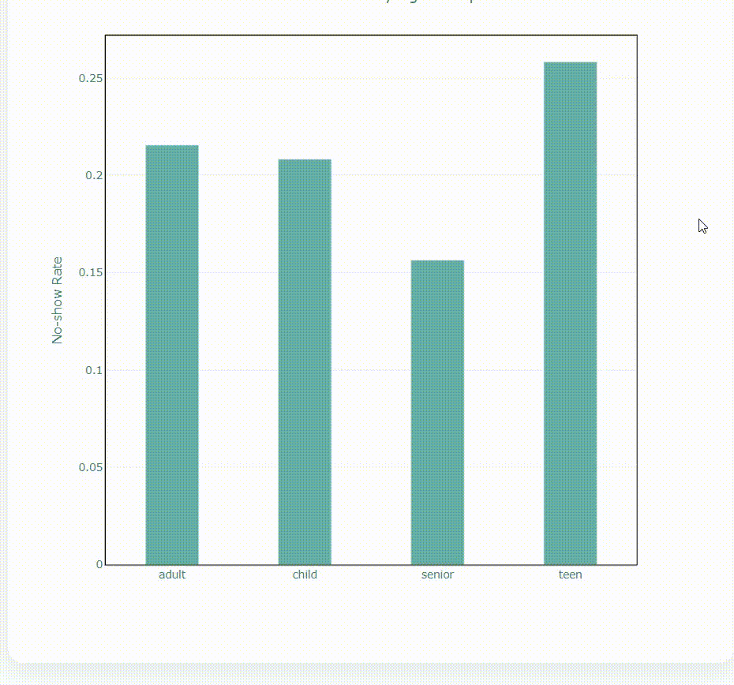

# 🏥 pandas-medical-appointment-no-show-analysis

A **healthcare analytics project using Pandas**, focused on understanding patient behavior, appointment dynamics, and factors associated with missed medical appointments (no-shows).

The project follows a **layered data pipeline architecture**, separating data cleaning, feature engineering, analytical aggregation, and visual reporting.

The main objective is to answer the question:  
**Why do patients miss their medical appointments, and which factors (age, SMS reminders, waiting time, weekday) are most associated with no-shows?**  
using interpretable statistical analysis rather than predictive modeling.

---

## 📌 Project Overview

Missed medical appointments reduce healthcare efficiency, increase operational costs, and limit access to care for other patients.

This project aims to:

- Measure overall no-show behavior  
- Identify patient groups with higher no-show rates  
- Analyze the impact of waiting time between scheduling and appointment  
- Evaluate the effect of SMS reminders on attendance  
- Explore weekday-based attendance patterns  

The project provides:

- A structured data pipeline (`raw → cleaned → featured → aggregated`)  
- Time-based and behavioral feature engineering  
- Group-level no-show rate analysis  
- Static PNG visualizations for reporting  

---

## 📊 Dataset

[**Medical Appointment No Shows Dataset (Kaggle)**](https://www.kaggle.com/datasets/joniarroba/noshowappointments)

The dataset contains appointment-level records from a public healthcare system.

### Key Attributes

- Patient demographics (age, gender, neighborhood)  
- Health conditions (hypertension, diabetes, alcoholism, disability)  
- Appointment timestamps (scheduled day, appointment day)  
- SMS reminder status  
- Target variable: **No-show (Yes / No)**  

> **Important:** In the dataset, `No-show = Yes` indicates that the patient did **not** attend the appointment.

### Data Organization

- Raw data: `data/raw`  
- Cleaned data: `data/clean`  
- Feature-engineered data: `data/featured`  

---

### 🧩 No-Show Analysis by Key Factors

#### 👥 No-Show Rate by Age Group
- Comparison of attendance behavior across different age segments  


---

#### 📩 Impact of SMS Reminders on Attendance
- No-show rates for patients who received SMS vs those who did not  


---

#### ⏳ No-Show Rate by Waiting Time
- Analysis of how delay between scheduling and appointment affects attendance  


---

#### 📅 No-Show Rate by Weekday
- Identifying which weekdays are associated with higher no-show risk  


---

### 🌐 Interactive Dashboard Preview

- All segment-based churn analyses are available in an interactive dashboard  
  with dropdown selection and dynamic KPI updates.


🖱️ **Live Dashboard:**  
<a href="https://busracevik.github.io/pandas-medical-appointment-noshow-analysis/index.html" target="_blank">View Interactive Churn Dashboard</a>

---

## 📁 Project Structure

```text
pandas-medical-appointment-noshow-analysis/
│
├── data/
│   ├── raw/
│   ├── clean/
│   └── featured/
│
├── outputs/
│   ├──csv/
│   └── figures/
│
├── docs/
│   ├── demo.gif
│   └── index.html   
│
├── src/
│   ├── data_cleaning.py
│   ├── feature_engineering.py
│   ├── analysis.py
│   └── visualization.py
│
├── notebooks/
│   └── exploration.ipynb
│
├── main.py
├── requirements.txt
└── README.md
```

---

## 🛠 Technologies Used

- **Python** – Core programming language  
- **Pandas** – Data cleaning, feature engineering, and aggregation  
- **NumPy** – Numerical operations and ratio calculations  
- **Matplotlib / Plotly** – Static and interactive visualizations  

---

## 🧠 Analytical Approach

This project focuses on **behavioral and operational healthcare analytics** rather than predictive modeling.  
No machine learning models are applied.

The analysis is based on:

- Time-based feature engineering from appointment timestamps  
- Patient segmentation by age and health indicators  
- Group-based statistical aggregation  
- Comparative evaluation of no-show rates across categories  

The goal is to understand **which conditions increase no-show risk** and provide  
**actionable insights for appointment scheduling and reminder strategies**,  
not to predict individual attendance outcomes.


